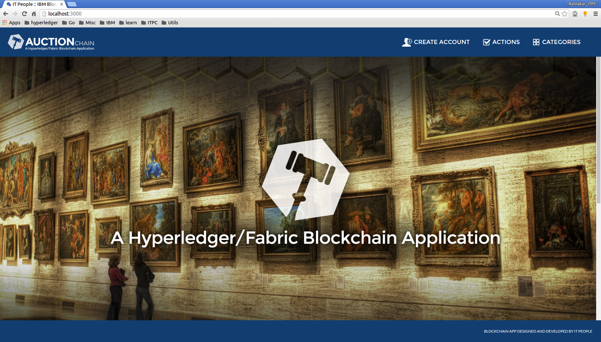

# Environment Setup
## Node JS
1. [Node.js](https://nodejs.org/en/download/) 0.12.0+ and npm v2+ (needed nodejs if you want to run the app locally, npm comes with node.js)
### Dependencies
Install the dependent libraries using below command 
``` 
    npm install <lib>
    
    $ npm install express
    $ npm install express
    $ npm install express
```

## Fabric
Please review instructions on setting up the [Development Environment](https://github.com/hyperledger/fabric/blob/master/docs/dev-setup/devenv.md).
Follow the [network setup](https://github.com/hyperledger/fabric/blob/master/docs/Setup/Network-setup.md) steps.

The installation of this is only necessary if you would like to create local network and execute the auction application using that network, Otherwise you can use [Bluemix](https://console.ng.bluemix.net/ ) service which provides 4 peer network along with membership service

## Credentials
If you are using [Bluemix service](https://console.ng.bluemix.net/), use the Credentials available from Bluemix service.
Update credentails.json with new values and replace localcreds.json with credentails.json file in app.js

```
Change the file name from localcred.json to credentials.json
    
var manual = JSON.parse(fs.readFileSync('credentials.json', 'utf8'));    
```


Follow instructions for [Bluemix network setup](https://github.com/IBM-Blockchain/marbles/blob/master/tutorial_part1.md#manual-network-setup)

Follow instructions [here](https://console.ng.bluemix.net/docs/starters/install_cli.html) for deploying your application.

# Workflow
Once the network is in place, kickoff the application by executing the following:

    $ node app.js

Once the application is started, you should see the following message on console:
```
####################### Server Up - localhost:3000 #######################
```

You will need to wait upto 1 minute before the application is fully deployed. Then you will see similar to following message:
```
[ibc-js] Deploy Chaincode - Complete
[d2cbc1ac45ee62c4acbca98e7d33ea5ae2771a37262678f15170285be979cbcf1addf3af79602f2f6c3da2f3846426419adaa838f636ce62668f3199edaab5c0]
```

Now you can point your browser at **http://localhost:3000** and you can see the auction homepage:




## Register a user on blcokchain
Register multiple users by clicking on "Create Account". 

For a quickstart execute in DEV mode, there is a script [PostUser](https://github.com/ITPeople-Blockchain/auction/blob/master/art/scripts/PostUsers) available.

*If not using the quickstart script, be sure to create an account for an Auction House with ID set to 200.* This is a temporary setup for demo purposes.

## Register an Asset
Once the user is registered, they can add an asset by clicking on **"Action" -> "Register Asset"**
Complete the requested fields. Keep in mind the User's Owner Id specified when creating the user account. This will be used for the "Current Owner ID" field.

Once the asset is registered, you can see the asset displayed on the auction homepage.

## Put an asset up for auction
Click on the **"Details"** button in the lower right corner of the asset image. You should see the **"Asset Details"** windows.

Enter values in the "Reserve Price" and "BuyItNow Price" (This field is Optional) spaces and click the **"PUT ON AUCTION"** button.

Now the asset is owned by the auction house.

## Opening an auction
Click on **"Actions" -> "Auctions"**. You should see the "**AUCTIONS"** window that will allow you to click on **"Open Auction"**
Enter a duration period in minutes and click on the **"OPEN AUCTION"** button at the bottom.

The Asset now is available for auction.

## Bid on Asset
Click on **"Actions" -> "Bid On Asset"**. Follow the instructions listed paying attention to the time remaining in the existing auction. Submit Bids with different available user IDs, **Highest Bid Price** will be updated periodically on UI.Clicking on **BuyItNow** will close the Auction immediately and no more auctions can be submitted.
Once Auction is closed updated details can be seen on Asset Details view.

## Transfer Asset
Click on **"Actions" -> "Transfer Asset"**. An asset can be transferred by entering existing user id and clicking on the 
Transfer button. Updated details can be seen from Detail View of the Asset.

### Known Issues
  - No Form Field validations
  - No User validation checks in UI screens like **Transfer Asset** and **Bid On Asset**
  - No indication in UI about Bid Price submitted or Ignore by backend/chaincode
  
### Troubleshoot
When local network is used, ibm-blockcahin-js library is failed to register users with membership service

```
[ibc-js] No membership users found after filtering, assuming this is a network w/o membership
```

As a work around, Comment 101 line in node_modules/ibm-blockchain-js/index.js as shown below
```
	// Step 2 - optional - only for secure networks
	if(options.network.users){
		//options.network.users = helper.filter_users(options.network.users);			//only use the appropriate IDs filter out the rest
	}
```

### Problems
  - EventListener support not available to check whether a transaction is successful or failed, there is an extra burden on the client, as it has to check for the same with multiple REST calls.

### Future Work
